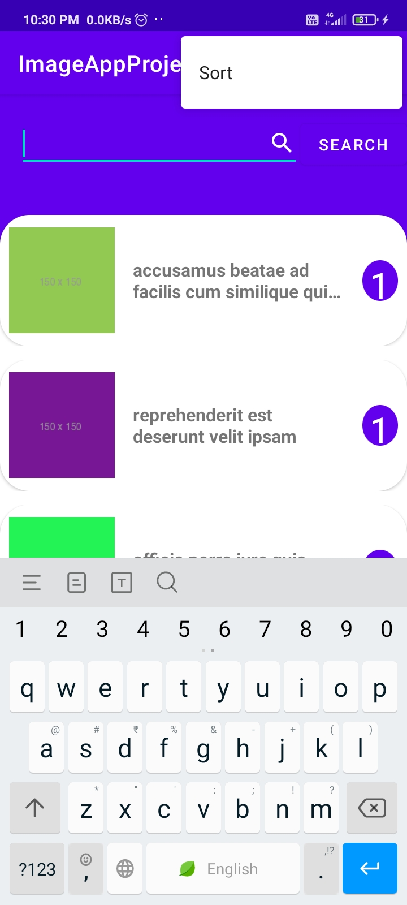

# ImageAppProject

This app Retrieve Data From Network Through **Api Call**.
It is Made using **HttpConnection , InputStream and Reader**.
**Picasso Library use For Image Retrieve and Load into ImageView**.
**RecyclerView and Room DataBase Used for Data Presistance Using ViewModel**.This app is made for Screening Assignment for Role of Android Intern in IsolPro Company.

### Note:-

-Here is the **Features Of This App**

1.Data From API. 
2.Refresh Data On Demand. 
3.Sort By Album Id. 
4.Search By Title . 
  

## Screenshots:-

&nbsp;&nbsp;&nbsp;&nbsp;&nbsp;&nbsp;&nbsp;&nbsp;&nbsp;

&nbsp;&nbsp;&nbsp;&nbsp;&nbsp;&nbsp;&nbsp;&nbsp;&nbsp; 
